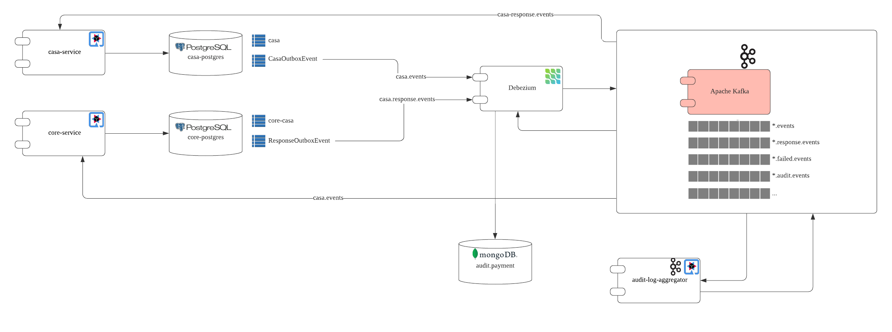

# Debezium Outbox Pattern Example

This is project to demonstrate how to implement Outbox Pattern using Debezium.



It is base on a fictional CASA payment transaction process. 

You can refers to the complete tutorial at [A True Atomic Microservices Implementation with Debezium to Ensure Data Consistency](https://braindose.blog/2021/09/13/true-atomic-microservices-debezium/)

### To Build this project

Install the Common and CommonOutbox into local maven repository:

```
mvn clean install -pl Commmon
```
```
mvn clean install -pl CommmonOutbox
```

Run the following mvn command in the modules directory:

```
mvn clean package
``` 

To build specific project:
```
mvn clean package -pl CasaService
```

## To run the modules as containers

1. Change your directory to `modules`

2. Run `docker compose` command

```
docker compose up --build
```