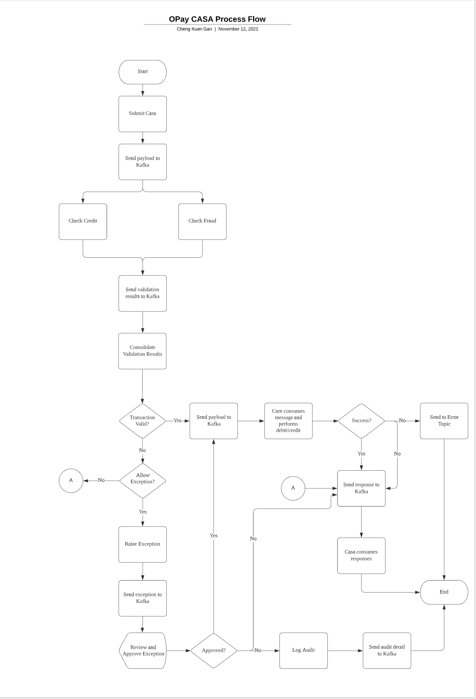
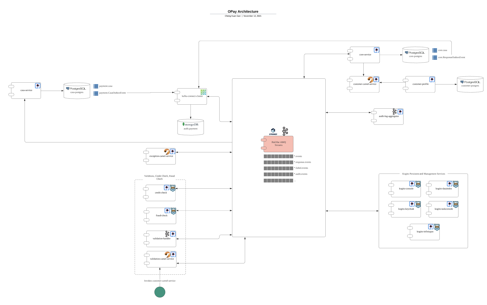

# Event-Driven Payment Exception Handling

This provides demo on using [Kogito](https://kogito.kie.org/) workflow and decision service to showcase how to implement an event-based payment exception handling.

It is an enhanced and extension from the previous demo at [Debezium Outbox](https://github.com/chengkuangan/Tutorials/tree/main/debezium-outbox). 

### What is the demo all about?

The demo showcase how can you implement event-driven payment exception handling. It centers around treating the payment transactions as event occurrences where multiple participating systems or services react to these events to perform their necessary processing in order to fulfill the payment transactions. 

Each of these services is decoupled and independent while still being able to work together to support the payment system as a whole.

The following provide some diagrams to illustrate the demo environment. 

For more detail explanation, please refer [Additional References](#additional-references) section





## To deploy this project

1. Clone this project onto your local disk.

2. With an OpenShift cluster running, install the Red Hat AMQ Streams Operator. Wait for it to be ready.

3. In command prompt, change your directory to the `bin`, run the following command to deploy the demo. The deployment wizard will walk you through the configuration required.

```
./deployDemo.sh -i
```

If you encounter error deploying the application modules, please refer the [Error while deploying the application modules](#error-while-deploying-the-application-modules)

## Sample Data

You can change the sample data for the demo. The following are files that you can modify before you deploy the demo.

- Sample data for `core-postgres` DB. The following shows the existing sample data in sql statements. Change the [import.sql](modules/CoreService/src/main/resources/import.sql) to add or modify.

```
insert into core.casa (accountNo, balance, createdTimestamp, dailyTotalAmount) values ('1-987654-1234-4569', 1000000000, CURRENT_TIMESTAMP, 0);
insert into core.casa (accountNo, balance, createdTimestamp, dailyTotalAmount) values ('1-234567-4321-9876', 3000000000, CURRENT_TIMESTAMP, 0);
```

- Sample data for `customer-postgres` DB. Make sure the `accountNo` are matching with the `core-postgres` DB. Locate the [import.sql here](modules/CustomerProfile/src/main/resources/import.sql).

```
insert into customer.profile (firstName, lastName, socialId, socialIdType) values ('John', 'Doe', '685912-26-5648', 'IC');
insert into customer.account (accountNo, accountType, custId, dailyLimit) values ('1-987654-1234-4569', 'CASA', (select custId from customer.profile), 2500.00);
insert into customer.address (address1, address2, postcode, city, state, country, type, custId) values ('No. 16, Lorong Utama 12', 'Taman Ayer Keroh Heights', '75450', 'Ayer Keroh', 'Melaka', 'MY', 'MAILING', (select custId from customer.profile));

insert into customer.profile (firstName, lastName, socialId, socialIdType) values ('Jenny', 'Joe', '154869-03-2587', 'IC');
insert into customer.account (accountNo, accountType, custId, dailyLimit) values ('1-234567-4321-9876', 'CASA', (select custId from customer.profile where custid = (select max(custid) from customer.profile)), 10000.00);
insert into customer.address (address1, address2, postcode, city, state, country, type, custId) values ('C-20, Lorong Chemor', 'Taman Desa Green', '11600', 'George Town', 'Penang', 'MY', 'MAILING', (select custId from customer.profile where custid = (select max(custid) from customer.profile)));
```


## How to navigate around the demo

You can refer to the following post for more details.

[Event-Driven Payment Exceptions Handling Using Kogito](https://braindose.blog/2021/11/15/event-driven-payment-exceptions-kogito/)

and the following Youtube video for the recorded demo:

[](https://www.youtube.com/watch?v=xLdiyJEEtHA)


## Quick Demo Steps

1. Find out the OpenShift domain name:
    ```
    $ oc get ingresses.config.openshift.io cluster -o json 2>/dev/null | jq -r .spec.domain
    apps.cluster-9ql4r.9ql4r.sandbox732.opentlc.com
    ```
2. Query to verify the database records created for `core-service`

    ```
    $ oc exec $(oc get pod -l app=core-service -o jsonpath="{.items[0].metadata.name}") -- curl http://localhost:8080/core/casa/1-987654-1234-4569 -w "\n"
    $ oc exec $(oc get pod -l app=core-service -o jsonpath="{.items[0].metadata.name}") -- curl http://localhost:8080/core/casa/1-234567-4321-9876 -w "\n"
    ```

2. Post a transaction

    ```
    # Replace the url with the correct domain name from previous command 

    $ curl -X POST \
    -H "Content-Type: application/json" \
    -d '{"recipientAccountNo": "1-987654-1234-4569","sourceAccountNo": "1-234567-4321-9876","amount": 50.00,"recipientReference": "Raspberry Pi 4 4GB"}' \
    http://casa-service-opay-apps.apps.cluster-9ql4r.9ql4r.sandbox732.opentlc.com/casa -w "\n"
    ```

3. Review the transaction audit. 
    Goto the OpenShift `admin console -> opay-apps (namespace) -> Networking -> Routes` and click on the `Location` for the `audit-ui`.

    ```
    # example using domain name from previous command 

    http://audit-ui-opay-apps.apps.cluster-9ql4r.9ql4r.sandbox732.opentlc.com/
    ```
4. Post another transaction that violates the business rules:
    ```
    # Replace the url with the correct domain name from previous command

    $ curl -X POST \
    -H "Content-Type: application/json" \
    -d '{"recipientAccountNo": "1-987654-1234-4569","sourceAccountNo": "1-234567-4321-9876","amount": 600000.00,"recipientReference": "Tesla"}' \
    http://casa-service-opay-apps.apps.cluster-9ql4r.9ql4r.sandbox732.opentlc.com/casa -w "\n"
    
    ```
5. Navigate to the `Opay Exception Handling` url to view the exceptions. You can find out the url at the admin console `Networking -> Routes`
    
    ```
    # Replace the url with the correct domain name from previous command

    http://exception-handler-opay-apps.apps.cluster-9ql4r.9ql4r.sandbox732.opentlc.com/
    ```

## Additional references

- [A True Atomic Microservices Implementation with Debezium to Ensure Data Consistency](https://braindose.blog/2021/09/13/true-atomic-microservices-debezium/)
- [Modernise the Payment Platform With Event-Based Architecture](http://braindose.blog/2021/11/09/modernise-payment-platform-event-based/)

## Error while deploying the application modules 

- If the error caused by `java.io.IOException: Pipe closed`, it is a known issue with Quarkus Openshift plugin. Refer the reported issued at [OpenShift: Annoying Random Issue when deploying into OpenShift #16968](https://github.com/quarkusio/quarkus/issues/16968). This is a random error where the connection closed too early during the deployment.

    It is recommended to use [S2I](https://access.redhat.com/documentation/en-us/red_hat_build_of_quarkus/1.11/html-single/deploying_your_quarkus_applications_to_openshift/index#proc-using-s2i-openshift-quarkus_quarkus-openshift) to deploy Quarkus for the moment. S2I requires each of the apps module has it's own git repository but since this a demo so it is not practical to maintain so many git repositories, thus, I choose to continue to deploy using the Quarkus plugin. 
    
    If you receives the above error, please proceed to continue the deployment manually by running the following commands in the sequence given below.

    1. Deploy the application modules using the following command. Previously successfull deloyed modules will be skipped. 
    
        Run this command multiple times until all apps modules are successfully deployed.
   
    ```cmd
    ./deployDemo.sh -m apps
    ```
    
    2. Import the sample data

    ```cmd
    ./deployDemo.sh -m sampleData
    ```
    3. Deploy and configure Kafka connect and connetors

    ```cmd
    ./deployDemo.sh -m kafkaConnect
    ```
    4. Expose the Openshift routes for the demo apps

    ```cmd
    ./deployDemo.sh -m routes
    ```
    
    The following show the example of the error:
    ```cmd
    [INFO] [io.quarkus.container.image.openshift.deployment.OpenshiftProcessor] Push successful
    [INFO] ------------------------------------------------------------------------
    [INFO] BUILD FAILURE
    [INFO] ------------------------------------------------------------------------
    [INFO] Total time:  51.136 s
    [INFO] Finished at: 2021-11-10T17:05:59+08:00
    [INFO] ------------------------------------------------------------------------
    [ERROR] Failed to execute goal io.quarkus.platform:quarkus-maven-plugin:2.2.3.Final:build (default) on project audit-log-aggregator: Failed to build quarkus application: io.quarkus.builder.BuildException: Build failure: Build failed due to errors
    [ERROR]         [error]: Build step io.quarkus.container.image.openshift.deployment.OpenshiftProcessor#openshiftBuildFromJar threw an exception: java.lang.RuntimeException: Execution of openshift build failed. See build output for more details
    [ERROR]         at io.quarkus.container.image.openshift.deployment.OpenshiftProcessor.openshiftException(OpenshiftProcessor.java:502)
    [ERROR]         at io.quarkus.container.image.openshift.deployment.OpenshiftProcessor.openshiftBuild(OpenshiftProcessor.java:448)
    [ERROR]         at io.quarkus.container.image.openshift.deployment.OpenshiftProcessor.lambda$openshiftBuild$10(OpenshiftProcessor.java:401)
    [ERROR]         at java.base/java.util.stream.ForEachOps$ForEachOp$OfRef.accept(ForEachOps.java:183)
    [ERROR]         at java.base/java.util.stream.ReferencePipeline$3$1.accept(ReferencePipeline.java:195)
    [ERROR]         at java.base/java.util.stream.ReferencePipeline$2$1.accept(ReferencePipeline.java:177)
    [ERROR]         at java.base/java.util.ArrayList$ArrayListSpliterator.forEachRemaining(ArrayList.java:1654)
    [ERROR]         at java.base/java.util.stream.AbstractPipeline.copyInto(AbstractPipeline.java:484)
    [ERROR]         at java.base/java.util.stream.AbstractPipeline.wrapAndCopyInto(AbstractPipeline.java:474)
    [ERROR]         at java.base/java.util.stream.ForEachOps$ForEachOp.evaluateSequential(ForEachOps.java:150)
    [ERROR]         at java.base/java.util.stream.ForEachOps$ForEachOp$OfRef.evaluateSequential(ForEachOps.java:173)
    [ERROR]         at java.base/java.util.stream.AbstractPipeline.evaluate(AbstractPipeline.java:234)
    [ERROR]         at java.base/java.util.stream.ReferencePipeline.forEach(ReferencePipeline.java:497)
    [ERROR]         at io.quarkus.container.image.openshift.deployment.OpenshiftProcessor.openshiftBuild(OpenshiftProcessor.java:401)
    [ERROR]         at io.quarkus.container.image.openshift.deployment.OpenshiftProcessor.createContainerImage(OpenshiftProcessor.java:345)
    [ERROR]         at io.quarkus.container.image.openshift.deployment.OpenshiftProcessor.openshiftBuildFromJar(OpenshiftProcessor.java:252)
    [ERROR]         at java.base/jdk.internal.reflect.NativeMethodAccessorImpl.invoke0(Native Method)
    [ERROR]         at java.base/jdk.internal.reflect.NativeMethodAccessorImpl.invoke(NativeMethodAccessorImpl.java:62)
    [ERROR]         at java.base/jdk.internal.reflect.DelegatingMethodAccessorImpl.invoke(DelegatingMethodAccessorImpl.java:43)
    [ERROR]         at java.base/java.lang.reflect.Method.invoke(Method.java:566)
    [ERROR]         at io.quarkus.deployment.ExtensionLoader$2.execute(ExtensionLoader.java:820)
    [ERROR]         at io.quarkus.builder.BuildContext.run(BuildContext.java:277)
    [ERROR]         at org.jboss.threads.ContextHandler$1.runWith(ContextHandler.java:18)
    [ERROR]         at org.jboss.threads.EnhancedQueueExecutor$Task.run(EnhancedQueueExecutor.java:2449)
    [ERROR]         at org.jboss.threads.EnhancedQueueExecutor$ThreadBody.run(EnhancedQueueExecutor.java:1478)
    [ERROR]         at java.base/java.lang.Thread.run(Thread.java:834)
    [ERROR]         at org.jboss.threads.JBossThread.run(JBossThread.java:501)
    [ERROR] Caused by: java.io.IOException: Pipe closed
    [ERROR]         at java.base/java.io.PipedInputStream.read(PipedInputStream.java:307)
    [ERROR]         at java.base/java.io.PipedInputStream.read(PipedInputStream.java:377)
    [ERROR]         at java.base/sun.nio.cs.StreamDecoder.readBytes(StreamDecoder.java:284)
    [ERROR]         at java.base/sun.nio.cs.StreamDecoder.implRead(StreamDecoder.java:326)
    [ERROR]         at java.base/sun.nio.cs.StreamDecoder.read(StreamDecoder.java:178)
    [ERROR]         at java.base/java.io.InputStreamReader.read(InputStreamReader.java:185)
    [ERROR]         at java.base/java.io.BufferedReader.fill(BufferedReader.java:161)
    [ERROR]         at java.base/java.io.BufferedReader.readLine(BufferedReader.java:326)
    [ERROR]         at java.base/java.io.BufferedReader.readLine(BufferedReader.java:392)
    [ERROR]         at io.quarkus.container.image.openshift.deployment.OpenshiftProcessor.openshiftBuild(OpenshiftProcessor.java:444)
    [ERROR]         ... 25 more
    [ERROR] -> [Help 1]
    [ERROR] 
    [ERROR] To see the full stack trace of the errors, re-run Maven with the -e switch.
    [ERROR] Re-run Maven using the -X switch to enable full debug logging.
    [ERROR] 
    [ERROR] For more information about the errors and possible solutions, please read the following articles:
    [ERROR] [Help 1] http://cwiki.apache.org/confluence/display/MAVEN/MojoExecutionException
    ```